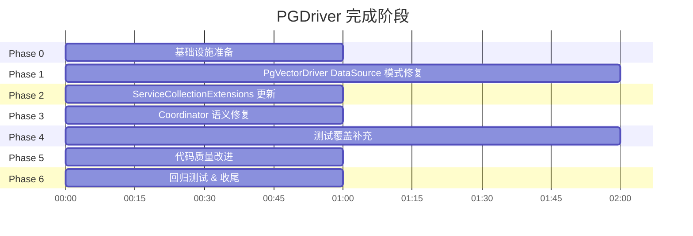

# PGDriver 完成计划

> **日期**: 2026-06-20  
> **状态**: Complete  
> **对应任务**: TODO.md

---

## 目录

1. [背景](#1-背景)
2. [目标](#2-目标)
3. [当前状态分析](#3-当前状态分析)
4. [阶段划分](#4-阶段划分)
5. [阶段详情](#5-阶段详情)
6. [测试策略](#6-测试策略)
7. [风险评估](#7-风险评估)

---

## 1. 背景

Adaptor 项目是一个 .NET 10 gRPC 中间件服务，通过模块化的 Driver 架构协调 SQL、Vector、BLOB 三种异构存储的分布式事务。

前两个工作会话完成了以下工作：

| 会话 | 完成内容 | 状态 |
|------|---------|:----:|
| **2026-06-20 Test & Debug** | 建立测试金字塔（62→243 测试），修复 5 个缺陷，使用 Testcontainers 集成测试 | ✅ |
| **2026-06-20 Driver Refactor** | 抽取 `NpgsqlConnectionManager` 消除重复代码，集成 pgvector-dotnet，修复 BLOB 随机访问路径（243→290 pass） | ✅ |

当前测试基线：**290 passed, 1 skipped**（唯一 skip 为 Session idle-timeout 手工测试）

### 遗留问题

尽管两个会话完成了大量工作，仍存在以下未完成项：

| ID | 问题 | 所属子系统 | 来源 |
|:--:|------|-----------|:----:|
| R1 | `AddAdaptorPgVectorDriver` 未创建带 `UseVector()` 的 DataSource | PGDriver DI | Refactor TODO 2.5 |
| R2 | `PgVectorDriver.EnsureExtensionAsync` 在 DataSource 模式下 `_connectionString` 为 null | PgVectorDriver | 新发现 |
| R3 | `CommitTransactionAsync` 对已回滚事务抛异常而非返回 `RolledBack` | Coordinator | Test & Debug |
| R4 | 缺少 pgvector-dotnet 类型映射的专用测试 | 测试 | Refactor TODO 2.6 |
| R5 | `ReadLargeObjectAsync` 5 个参数需重构 | PostgresBlobDriver | Refactor 发现 |
| R6 | `TransactionServiceImpl.BeginTransaction` 因 `GetHttpContext()` 无法单元测试 | Service | Test & Debug |
| R7 | `PgVectorDriverTest` 中向量参数格式化的断言需更新 | 测试 | Refactor TODO 2.6 |

---

## 2. 目标

1. **完成遗留工作** — 解决 R1-R7 所有已知遗留问题
2. **完整实现设计功能** — 确保 PGDriver 子系统的三个 Driver 完全符合 `Design/DETAILED-DESIGN.md` 和 `Design/BLOB-STREAM-DESIGN.md` 的要求
3. **代码质量** — 符合 `Design/Working Guidelines.md` 的要求（参数数量、文档风格、错误处理等）

---

## 3. 当前状态分析

### 3.1 PgVectorDriver DataSource 模式问题

当前 `PgVectorDriver` 支持两种构造方式：

```csharp
// 方式 1: 原始连接字符串（无 pgvector 类型映射）
public PgVectorDriver(string connectionString, ILogger<PgVectorDriver>? logger = null)

// 方式 2: NpgsqlDataSource（推荐，支持 UseVector()）
public PgVectorDriver(NpgsqlDataSource dataSource, ILogger<PgVectorDriver>? logger = null)
```

**问题 R1**: `ServiceCollectionExtensions.AddAdaptorPgVectorDriver` 只使用方式 1：

```csharp
public static IServiceCollection AddAdaptorPgVectorDriver(
    this IServiceCollection services,
    string connectionString)
{
    services.AddAdaptorDriver<PgVectorDriver>(sp =>
        new PgVectorDriver(connectionString));  // ← 没有 DataSource
    return services;
}
```

**问题 R2**: `EnsureExtensionAsync` 硬编码使用 `_connectionString`：

```csharp
private async Task EnsureExtensionAsync(CancellationToken ct)
{
    await using var conn = new NpgsqlConnection(_connectionString);  // ← DataSource 模式下为 null!
    ...
}
```

### 3.2 Coordinator rollback-on-commit 语义问题

当前 `CommitTransactionAsync` 的行为与设计不符：

| 场景 | 设计行为 | 当前实现 |
|------|---------|---------|
| 对已回滚事务调用 Commit | 返回 `CommitResult(RolledBack, ...)` | 抛出 `InvalidOperationException` |
| 对不存在的事务调用 Commit | 返回 `CommitResult(RolledBack, ...)` | 抛出 `InvalidOperationException` |

### 3.3 测试覆盖缺口

- **pgvector-dotnet 类型映射**: 无专用测试验证 `Vector`/`SparseVector` 对象通过 Npgsql 的正确往返
- **Service gRPC**: `BeginTransaction` 需要 ASP.NET Core 宿主，目前跳过
- **向量参数断言**: `PgVectorDriverTest` 中部分测试使用旧 API 的字符串格式

### 3.4 代码质量

- `ReadLargeObjectAsync` 有 5 个参数，处于工作指南的"需考虑重构"边界
- `OpenAsync` 方法体过长（~100 行），含多个嵌套分支

---

## 4. 阶段划分



| Phase | 名称 | 主要任务 |
|:-----:|------|---------|
| **0** | 基础设施准备 | 建立测试基线，确认 290/1 状态 |
| **1** | PgVectorDriver DataSource 模式修复 | 修复 R2：`EnsureExtensionAsync` DataSource 路径；重构构造函数 |
| **2** | ServiceCollectionExtensions 更新 | 修复 R1：添加 DataSource 重载 |
| **3** | Coordinator 语义修复 | 修复 R3：rollback-on-commit 返回正确结果 |
| **4** | 测试覆盖补充 | 修复 R4/R7：pgvector 类型映射测试 + 更新断言 |
| **5** | 代码质量改进 | 修复 R5：`ReadLargeObjectAsync` 参数重构 + `OpenAsync` 提取 |
| **6** | 回归测试 & 收尾 | 全面回归，Work Summary |

---

## 5. 阶段详情

### Phase 0: 基础设施准备

**目标**: 确保在修改前有可靠的测试基线

| 任务 | 说明 |
|------|------|
| 0.1 | 运行所有现有测试，确认 290 pass / 1 skip |
| 0.2 | 确认项目可构建（`dotnet build`） |
| 0.3 | 检查所有 `[Fact(Skip)]` 标记，确认哪些仍需跳过 |

### Phase 1: PgVectorDriver DataSource 模式修复

**目标**: 修复 DataSource 模式下 `EnsureExtensionAsync` 崩溃问题

**问题**: `EnsureExtensionAsync` 使用 `new NpgsqlConnection(_connectionString)`，但 DataSource 模式下 `_connectionString` 为 null。

**方案**:
1. 从 `NpgsqlConnectionManager` 获取一个临时连接用于 `CREATE EXTENSION`
2. 或添加 `_dataSource.CreateConnection()` 路径
3. 需要确保连接在非事务上下文中执行 `CREATE EXTENSION`

**涉及文件**:
- `src/Driver/Postgre/PgVectorDriver.cs` — `EnsureExtensionAsync` 方法
- `src/Driver/Postgre/NpgsqlConnectionManager.cs` — 添加临时连接创建方法（可选）

### Phase 2: ServiceCollectionExtensions 更新

**目标**: 为 `AddAdaptorPgVectorDriver` 和 `AddAdaptorPostgreDrivers` 添加 DataSource 重载

**方案**:
```csharp
public static IServiceCollection AddAdaptorPgVectorDriver(
    this IServiceCollection services,
    NpgsqlDataSource dataSource)  // 新增 DataSource 重载
```

**涉及文件**:
- `src/Coordinator/ServiceCollectionExtensions.cs` — 当前只有 Coordinator 注册
- `src/Driver/Postgre/ServiceCollectionExtensions.cs` — PG 驱动注册

### Phase 3: Coordinator 语义修复

**目标**: 修复 `CommitTransactionAsync` 对已回滚事务的行为

**涉及文件**:
- `src/Coordinator/Services/TransactionCoordinator.cs`

### Phase 4: 测试覆盖补充

**目标**:
1. 添加 pgvector-dotnet 类型映射的专用集成测试（使用 `NpgsqlDataSource` + `UseVector()`）
2. 更新 `PgVectorDriverTest` 中关于向量参数格式化的断言
3. 解决 R6（Service gRPC 测试）——短期方案：保持 skip，添加文档说明

**涉及文件**:
- `test/Adaptor.Test.Driver/PgVectorDriverIntegrationTest.cs` — 新增类型映射测试
- `test/Adaptor.Test.Driver/PgVectorDriverTest.cs` — 更新断言

### Phase 5: 代码质量改进

**目标**:
1. 重构 `ReadLargeObjectAsync`：参数 > 5，打包为请求 record
2. 提取 `OpenAsync` 中的分支逻辑

**涉及文件**:
- `src/Driver/Postgre/PostgresBlobDriver.cs`

### Phase 6: 回归测试 & 收尾

**目标**:
1. 全面回归测试
2. 更新 `Work Summary.md`
3. 更新 `TODO.md` 标记完成状态

---

## 6. 测试策略

| 层次 | 策略 |
|------|------|
| **单元测试** | 每次修改后运行相关测试；验证接口契约和边界条件 |
| **集成测试** | DataSource 模式测试需要 Testcontainers Docker 环境 |
| **回归** | Phase 6 运行完整 `dotnet test`，确认 >= 290 pass，<= 1 skip |

### 测试驱动要求

1. **变更前先写测试**: 对修复 bug（R2, R3），先编写暴露 bug 的测试，再修复
2. **测试验证重构**: 对重构（R5），先确认现有测试通过，重构后再次确认
3. **测试即文档**: 测试应反映设计目标，而非拟合实现行为

---

## 7. 风险评估

| 风险 | 影响 | 可能性 | 缓解措施 |
|------|:----:|:------:|---------|
| DataSource 模式下 `CREATE EXTENSION` 需要非事务连接 | High | High | 使用 DataSource 创建独立连接；参考现有测试中的模式 |
| `lo_truncate64` 在 PG17 中可用性 | Medium | Low | 已在部署镜像 `pgvector/pgvector:0.8.0-pg17` 中使用 PG17 |
| Service gRPC `BeginTransaction` 测试需要 ASP.NET Core 宿主 | Low | High | 保持 skip；由 Coordinator 集成测试间接覆盖 |
| Testcontainers 资源冲突 | Low | Medium | 使用独立端口和容器名称 |
