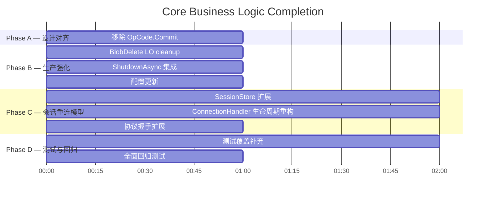

# Core Business Logic Completion Plan

> **日期**: 2026-06-20
> **状态**: Complete
> **对应任务**: TODO.md

---

## 1. 背景

Adaptor 项目是一个 .NET 10 gRPC 中间件服务，通过模块化的 Driver 架构协调 SQL、Vector、BLOB 三种异构存储的分布式事务。经过前序四个工作会话后，代码库已达到 **324 测试通过、0 跳过** 的基线。

### 前序工作

| 会话 | 完成内容 | 测试状态 |
|------|---------|:--------:|
| **2026-06-18 Design** | 架构设计、命名重构 | — |
| **2026-06-20 Test & Debug** | 建立测试金字塔（62→243 测试），修复 5 个缺陷 | 236/7 |
| **2026-06-20 Driver Refactor** | 抽取 `NpgsqlConnectionManager`，集成 pgvector-dotnet，修复 BLOB 随机访问路径（243→290 pass） | 290/1 |
| **2026-06-20 PGDriver Completion** | 解决所有 7 个遗留问题（R1-R7），修复 ServiceCollectionExtensions/Coordinator 语义/测试基础结构（290→324 pass） | **324/0** |

### 当前架构状态

```
┌──────────────────────────────────────────────────────────────┐
│  Service Layer (gRPC) — 324 tests ✅                          │
│  ├─ TransactionServiceImpl      ✅  完整的 tx 生命周期       │
│  ├─ RelationalServiceImpl      ✅  Execute/Query/Batch       │
│  ├─ RelationalVectorServiceImpl ✅  Vector Search            │
│  ├─ BlobServiceImpl             ✅  Upload/Download/Delete   │
│  ├─ BlobStreamSessionServiceImpl ✅ BeginSession/EndSession  │
│  └─ BlobStreamConnectionHandler ⚠️ 缺少断开暂停/重连支持    │
├── Coordinator Layer — 125 tests ✅                           │
│  ├─ TransactionCoordinator      ✅ 完整的 2PC 生命周期       │
│  ├─ SessionManager              ✅ 会话管理与超时清理        │
│  ├─ Plugins                     ✅ SK Plugin 薄转发层        │
│  └─ Models/Abstractions         ✅ 数据模型与能力接口        │
├── Driver Layer — 88 tests ✅                                │
│  ├─ PostgreSqlDriver            ✅ SQL Execute/Query         │
│  ├─ PgVectorDriver              ✅ Vector Search + pgvector  │
│  └─ PostgresBlobDriver          ✅ Unary+RandomAccess        │
├── BlobStream — 80 tests ✅                                  │
│  ├─ HandleManager               ✅ Handle 生命周期          │
│  ├─ BlobStreamMessage           ✅ TLV 协议编解码           │
│  ├─ BlobStreamSessionStore      ⚠️ 缺少 tx 关联/重连支持   │
│  └─ BlobStreamConnectionHandler ⚠️ 缺少暂停语义/重连       │
└── Protocol — OpCode.Commit ❌ 与设计文档 Control/Data Plane 分离原则冲突
```

---

## 2. 目标

1. **设计对齐** — 移除与 Control/Data Plane 分离原则冲突的 `OpCode.Commit`
2. **生产强化** — 修复资源泄漏（BlobDelete LO cleanup）、生命周期挂接（ShutdownAsync）、配置清理
3. **会话重连模型** — 实现设计文档确认的 WS 断开暂停语义（Pause/Abort/Terminate）、令牌重连
4. **测试覆盖** — 所有变更先写测试后实现，确保 0 跳过
5. **工作方法** — 严格遵循 TDD：先写测试、后实现、利用测试调试

---

## 3. 当前差距分析

### 3.1 Functional Analysis 实施计划

来自 `Middleware-Functional-Analysis.md` Part 3 的实施计划：

| 阶段 | 内容 | 当前状态 |
|:----:|------|:--------:|
| Phase 1 | Fix BlobStream random-access position state | ✅ 已在 PGDriver Refactor 中完成 |
| Phase 2 | **Remove OpCode.Commit** | ❌ `OpCode.cs` 仍包含 `Commit = 0x07`；`BlobStreamConnectionHandler` 仍保留 `HandleCommitAsync` 和处理分支 |
| Phase 3 | **Session store transaction association** | ❌ `BlobStreamSessionEntry` 没有 `TransactionResult`/`PauseStartedAt`/`ActiveConnectionId` |
| Phase 4 | **ConnectionHandler lifecycle refactor** | ❌ WS 断开立即回滚事务（应为 pause）；不支持重连 |
| Phase 5 | **Protocol handshake extension** | ❌ Handshake 不包含 `reconnected` 标志位 |
| Phase 6 | **Configuration updates** | ❌ `CoordinatorOptions` 缺少 `PausedTransactionTimeout`；`appsettings.json` 仍包含 `MaxRetryCount`/`RetryBackoffBase` |
| Phase 7 | **Clean up other defects** | ❌ BlobDelete 未调用 `lo_unlink`；ShutdownAsync 未挂接到 `ApplicationStopping` |

### 3.2 核心 vs 高级分类

| 功能 | 分类 | 说明 |
|------|:----:|------|
| 移除 OpCode.Commit | 🔵 核心 | 设计强制要求：所有提交路径必须通过 gRPC |
| BlobDelete LO cleanup | 🟡 核心 | 存储泄漏，生产环境中会导致 PG 磁盘膨胀 |
| ShutdownAsync 集成 | 🟡 核心 | 优雅关闭是生产环境基本要求 |
| 配置清理 | 🟢 核心 | 死配置影响运维清晰度 |
| 会话重连模型 | 🔵 高级 | 但已被设计确认，作为统一会话模型实现 |
| 断开暂停语义 | 🔵 高级 | 同上 |
| 协议握手扩展 | 🔵 高级 | 同上 |

---

## 4. 阶段划分



| Phase | 名称 | 主要内容 |
|:-----:|------|---------|
| **A** | 设计对齐 | 移除 `OpCode.Commit`，更新设计文档 |
| **B** | 生产强化 | BlobDelete LO cleanup、ShutdownAsync 集成、配置清理 |
| **C** | 会话重连模型 | SessionStore 扩展、ConnectionHandler 生命周期重构、握手协议扩展 |
| **D** | 测试与回归 | 新增测试覆盖所有变更、全面回归测试确保 0 失败 |

---

## 5. 阶段详情

### Phase A: 设计对齐 — 移除 OpCode.Commit

**目标**: 消除 WebSocket 协议中的提交路径，确保所有提交经 gRPC，符合 Control/Data Plane 分离原则。

**设计决策（Functional Analysis Decision 1）**:
> **OpCode.Commit (0x07) will be removed** — all commits go through gRPC

**涉及文件**:

| 文件 | 变更 |
|------|------|
| `src/Service/BlobStream/Protocol/OpCode.cs` | 删除 `Commit = 0x07` 常量 |
| `src/Service/BlobStream/BlobStreamConnectionHandler.cs` | 删除 `HandleCommitAsync` 方法；从 `ProcessRequestAsync` switch 中移除 `OpCode.Commit` 分支 |
| `test/Adaptor.Test.BlobStream/BlobStreamMessageTest.cs` | 更新 `OpCodes_ShouldMatchDesign` 断言：不再包含 `0x07` |
| `test/Adaptor.Test.BlobStream/BlobStreamConnectionHandlerTest.cs` | 移除或更新与 Commit 相关的测试 |

**步骤**:
1. 更新 `OpCodes_ShouldMatchDesign` 测试 — 移除 `OpCode.Commit` 断言 → 测试失败（红）
2. 从 `OpCode.cs` 删除 `Commit` 常量 → 测试通过（绿）
3. 从 `BlobStreamConnectionHandler.cs` 删除 `HandleCommitAsync` 和 dispatch 分支 → 构建通过
4. 检查 `BlobStreamConnectionHandlerTest.cs` 中是否有需要更新的 Commit 相关测试
5. 运行 BlobStream 测试确认 ✅

---

### Phase B-1: BlobDelete LO Cleanup

**目标**: 修复 BLOB 删除时的 PostgreSQL Large Object 存储泄漏。

**问题**: `BlobServiceImpl.BlobDelete` 仅从 `adaptor_blob_store` 表中删除映射记录，但未调用 `lo_unlink` 释放 Large Object。

**当前代码** (`src/Service/Services/AdaptorService.cs`):
```csharp
// 删除了映射记录，但 LO 仍然占用磁盘空间
var sql = $"DELETE FROM adaptor_blob_store WHERE key = @key";
```

**实现方案**: 在执行 `DELETE` 之前，先查询 OID 并调用 `lo_unlink(oid)`。

**涉及文件**:

| 文件 | 变更 |
|------|------|
| `src/Service/Services/AdaptorService.cs` | BlobDelete：先查询 OID → `SELECT lo_unlink(oid)` → 再删除映射记录 |
| `test/Adaptor.Test.Service/GrpcServiceTests.cs` | 添加 BlobDelete LO cleanup 测试（mock driver 验证 lo_unlink 被调用）|

**注意事项**:
- `lo_unlink` 必须在事务内执行（参与 2PC）
- 如果 `lo_unlink` 失败但 DELETE 成功 → 数据不一致。因此要么先 `lo_unlink` 再 DELETE，要么在一个事务内完成
- 更好的做法：在一个 SQL 批处理中完成：先 `SELECT oid INTO _oid ...; PERFORM lo_unlink(_oid); DELETE FROM ...`

---

### Phase B-2: ShutdownAsync 集成

**目标**: 在应用优雅关闭时调用 `TransactionCoordinator.ShutdownAsync()`。

**问题**: `Program.cs` 未注册 `app.Lifetime.ApplicationStopping` 回调。

**涉及文件**:

| 文件 | 变更 |
|------|------|
| `src/Service/Program.cs` | 添加 `app.Lifetime.ApplicationStopping.Register(...)` 回调，注入 `TransactionCoordinator` 并调用 `ShutdownAsync` |

**注意事项**:
- `ShutdownAsync` 接受 `TimeSpan gracePeriod` 参数（默认 5 秒或其他合理值）
- 需要在 `Program.cs` 中获取 `TransactionCoordinator` 实例
- 可能的实现方式：通过 `app.Services.GetRequiredService<TransactionCoordinator>()` 获取

---

### Phase B-3: 配置更新

**目标**: 清理死配置，添加缺失的 BlobStream 超时配置。

**问题**: 
1. `appsettings.json` 仍包含 `MaxRetryCount` 和 `RetryBackoffBase`（已在 `CoordinatorOptions` 中删除）
2. `CoordinatorOptions` 缺少 `PausedTransactionTimeout`
3. `appsettings.json` 缺少 BlobStream 超时配置

**涉及文件**:

| 文件 | 变更 |
|------|------|
| `src/Coordinator/Configuration/CoordinatorOptions.cs` | 添加 `PausedTransactionTimeout`（默认 5 分钟） |
| `src/Service/appsettings.json` | 删除 `MaxRetryCount`/`RetryBackoffBase`；添加 `BlobStreamTransactionTimeout`/`MaxBlobStreamTransactionTimeout`/`PausedTransactionTimeout` |

---

### Phase C-1: Session Store Transaction Association

**目标**: 扩展 `BlobStreamSessionEntry` 以支持事务关联、重连追踪和暂停超时。

**设计决策（Decision 2, 3, 5, 7）**:

**当前 `BlobStreamSessionEntry`**:
```csharp
public sealed record BlobStreamSessionEntry : IDisposable
{
    public string Token { get; init; }
    public BlobStreamSessionParams Parameters { get; init; }
    public DateTime CreatedAt { get; init; }
    public DateTime ExpiresAt { get; init; }
    public CancellationTokenSource? WsCancellation { get; set; }
    public string? ConnectionId { get; set; }
    public bool IsConnected => ConnectionId != null;
}
```

**扩展后的 `BlobStreamSessionEntry`**:

| 新增字段 | 类型 | 说明 |
|----------|------|------|
| `TransactionId` | `string?` | 关联的事务 ID（WS 连接时设置） |
| `PauseStartedAt` | `DateTime?` | WS 断开时间（开始暂停计时） |
| `ReconnectCount` | `int` | 重连次数 |

**新增方法**:
- `TryReconnect(string connectionId)` → `bool`：尝试重连，验证事务是否仍 Active，更新 ConnectionId

**涉及文件**:

| 文件 | 变更 |
|------|------|
| `src/Service/BlobStream/BlobStreamSessionEntry.cs` | 如果 session entry 是独立文件则修改；否则修改 `BlobStreamSessionStore.cs` 中的 entry 定义 |
| `src/Service/BlobStream/BlobStreamSessionStore.cs` | 修改 `Create()` 可选接受 `BeginTransactionResult`；添加 `TryReconnect()`；修改 `CleanupExpiredSessions` 检查 `PauseStartedAt` |
| `src/Service/BlobStream/BlobStreamConnectionHandler.cs` | 创建事务后将 `TransactionId` 存入 session entry |

---

### Phase C-2: ConnectionHandler Lifecycle Refactor

**目标**: 重新设计 WebSocket 连接生命周期以支持暂停/重连语义。

**当前行为**:
```
WS Connect → 创建新事务 → 消息循环 → WS 断开 → 回滚事务
```

**目标行为**:
```
WS Connect (首次) → 创建事务 → 消息循环 → WS 断开(Pause) → 暂停计时开始
WS Reconnect (超时前) → 恢复现有事务 → 消息循环 → WS 断开(Pause) → ...
WS Reconnect (超时后) → 事务已回滚 → 拒绝重连
WS 正常关闭/EndSession → 回滚事务(Terminate)
```

**设计决策**:

| 状态 | 触发条件 | 事务 | Handles | Session Token |
|:----:|----------|:----:|:-------:|:------------:|
| **Pause** | WS 网络断开 | 保持 | 清理 | 有效 |
| **Abort** | PauseTimeout 或 TxTimeout 超时 | 回滚 | 释放 | 无效 |
| **Terminate** | gRPC `EndSession` / WS Close 帧 | 回滚 | 释放 | 无效 |

**涉及文件**:

| 文件 | 变更 |
|------|------|
| `src/Service/BlobStream/BlobStreamConnectionHandler.cs` | 重大重构：拆分 `HandleAsync`，支持首次连接 vs 重连路径；断开时 pause 而非 rollback；重连时验证事务状态 |

**新 `HandleAsync` 流程**:
```
1. Validate session token
2. TryReconnect(sessionToken) → 如果成功，重用现有事务
3. 如果是首次连接 → coordinator.BeginBlobStreamTransactionAsync()
4. 发送握手响应（含 reconnected 标志）
5. 进入消息循环
6. 非优雅断开 → CleanupConnectionAsync (清理 handles) + 设置 PauseStartedAt
7. 正常关闭 → CleanupTransactionAsync (回滚事务)
8. gRPC EndSession → sessionCancelCts.Cancel() → Terminate
```

---

### Phase C-3: Protocol Handshake Extension

**目标**: 扩展握手协议以支持重连标志，使客户端能区分首次连接和重连。

**当前握手响应**:
```csharp
BuildHandshakeResponse(txId, expiresAt)
// [4B txIdLen][UTF8 txId][8B expiresAtUnixMs]
```

**扩展后握手响应**:
```csharp
BuildHandshakeResponse(txId, expiresAt, reconnected)
// [4B txIdLen][UTF8 txId][8B expiresAtUnixMs][1B flags]
// flags: bit 0 = reconnected
```

**涉及文件**:

| 文件 | 变更 |
|------|------|
| `src/Service/BlobStream/Protocol/BlobStreamMessage.cs` | 扩展 `BuildHandshakeResponse` 方法 |
| `test/Adaptor.Test.BlobStream/BlobStreamMessageTest.cs` | 更新 `BuildHandshakeResponse_ShouldIncludeTxIdAndExpiry` 测试 |

---

## 6. 测试策略

### 6.1 TDD 流程

```
对于每个变更:
  1. 编写/更新测试 → 确认新测试失败（红）
  2. 实现变更 → 确认新测试通过（绿）
  3. 运行相关测试套件 → 确认无回归
  4. 代码审查 → XML doc 符合 Working Guidelines.md
```

### 6.2 测试定位

| Phase | 测试类型 | 位置 |
|:-----:|----------|------|
| A | 单元测试 | `test/Adaptor.Test.BlobStream/` |
| B-1 | 单元测试 + 集成测试 | `test/Adaptor.Test.Service/` + `test/Adaptor.Test.Driver/` |
| B-2 | 集成测试（可选） | 验证 `Program.cs` 生命周期注册 |
| B-3 | 断言验证 | XML doc 检查 |
| C-1 | 单元测试 | `test/Adaptor.Test.BlobStream/BlobStreamSessionStoreTest.cs` |
| C-2 | 单元测试 | `test/Adaptor.Test.BlobStream/BlobStreamConnectionHandlerTest.cs` |
| C-3 | 单元测试 | `test/Adaptor.Test.BlobStream/BlobStreamMessageTest.cs` |

### 6.3 回归标准

- 所有现有 324 测试继续通过
- 新增测试全部通过
- 0 skipped

---

## 7. 风险评估

| 风险 | 等级 | 缓解措施 |
|------|:----:|---------|
| 会话重连模型引入并发问题 | 🟡 | HandleManager 已有 `ConcurrentDictionary`；SessionStore 需确保线程安全 |
| 握手协议扩展破坏现有客户端 | 🟡 | 向后兼容：添加 flags 字节而非修改现有字段；旧客户端忽略额外字节 |
| BlobDelete LO cleanup 与现有 DELETE 的原子性 | 🟡 | 在同一个事务内完成：`lo_unlink` + `DELETE`；使用 SQL 函数确保原子性 |
| ShutdownAsync 在关闭时阻塞 | 🟢 | `ShutdownAsync` 已有 `gracePeriod` 超时机制 |
